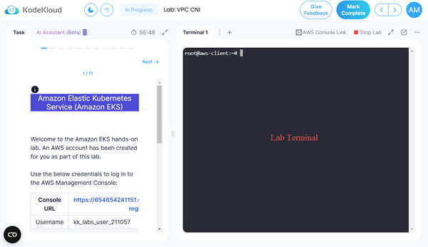

# Amazon EKS Cluster

In this guide, we will deploy an EKS cluster for use with any of our courses where an EKS cluster is required using Terraform. This cluster utilises an *unmanaged* node group, i.e. one we have to deploy and join manually as the playground does not support the creation of managed node groups.

You will enter all deployment commands at the lab terminal as shown below.

Now proceed to the [deployment instructions](./deploy.md)

